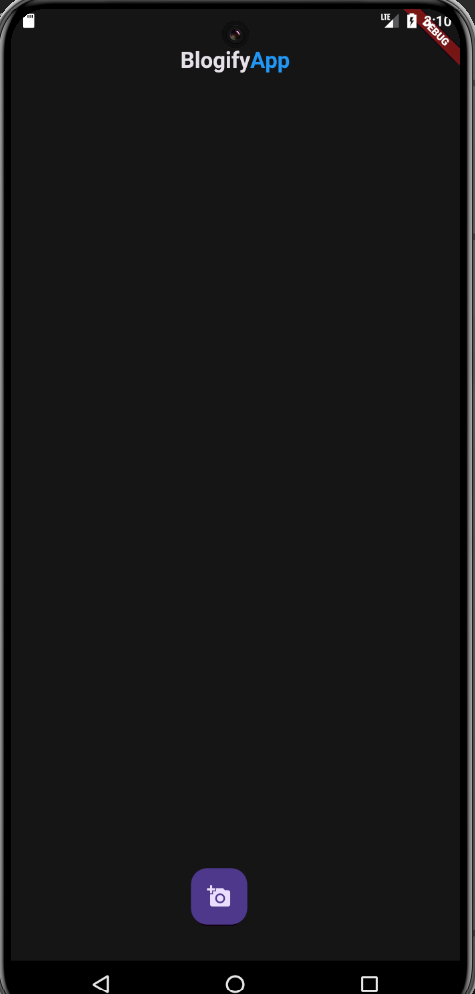
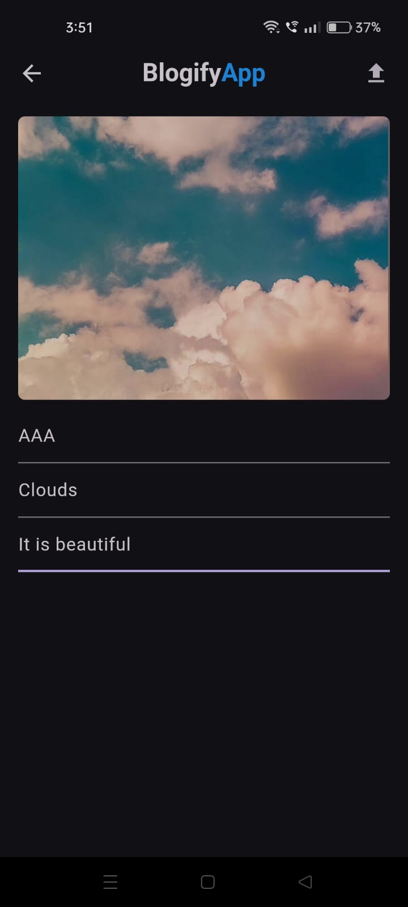
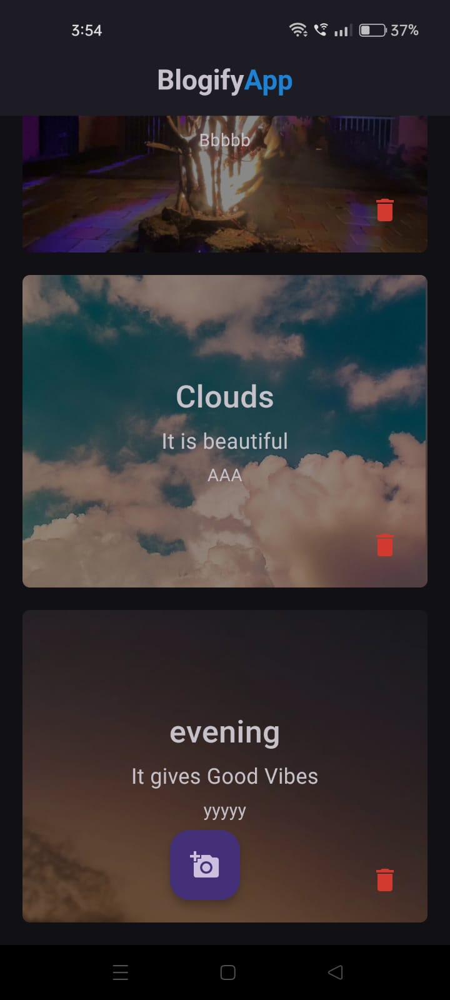

# BlogifyApp - Flutter Blog Sharing App


## Overview

**BlogifyApp** is a mobile application where users can share blog posts with images, titles, descriptions, and author names. Built using Flutter and Dart with Firebase as the backend, the app allows users to perform full CRUD (Create, Read, Update, Delete) operations on blog posts. BlogifyApp provides a simple, intuitive platform for users to share their thoughts and ideas with others.

## Features

- **Create Blog Post**: Users can upload images and add titles, descriptions, and their author name.
- **Read Blog Posts**: View all blog posts with details like the title, image, description, and author.
- **Update Blog Post**: Users can edit their existing posts.
- **Delete Blog Post**: Users can remove their posts when no longer needed.
- **Firebase Integration**: Utilizes Firebase Firestore for database storage and Firebase Storage for image hosting.

## Screenshots






## Getting Started

To get started with BlogifyApp, follow the steps below.

### Prerequisites

- **Flutter SDK**: [Install Flutter](https://flutter.dev/docs/get-started/install)
- **Dart SDK**: [Install Dart](https://dart.dev/get-dart)
- **Firebase Account**: Set up Firebase Firestore and Firebase Storage
- **IDE**: Visual Studio Code, Android Studio, or any preferred code editor

### Installation

1. Clone the repository:

   ```bash
   git clone https://github.com/VijaySelvaraj19/blogifyApp.git
   cd blogifyapp

2. Install dependencies:

   ```bash
   flutter pub get   

3. Run the app:

   ```bash
   flutter run  

4. Set up Firebase:

   1)Create a Firebase project.

   2)Enable Firestore and Firebase Storage.
   
   3)Add your google-services.json (for Android) or GoogleService-Info.plist (for iOS) in the respective directory.


